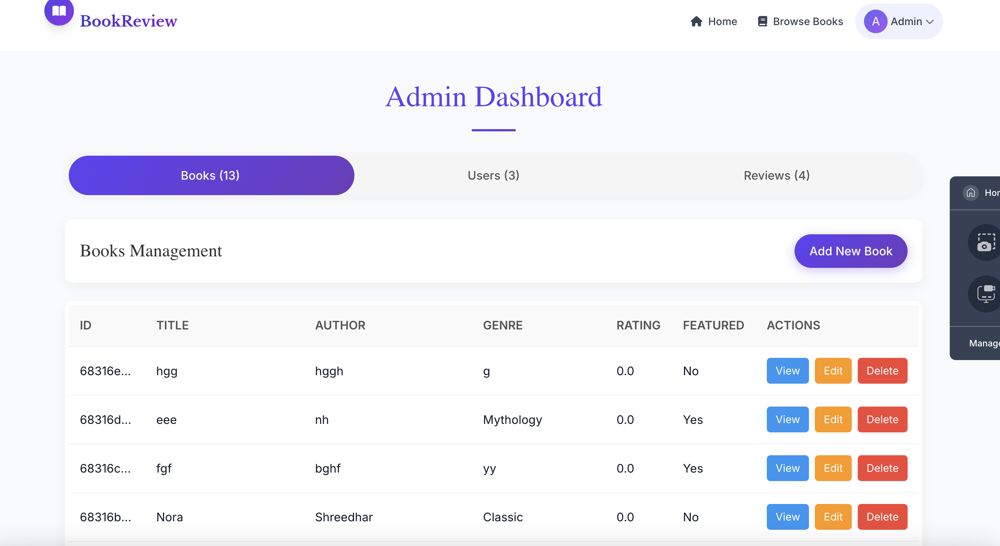

# BookReview - Interactive Book Review Platform

BookReview is a full-stack web application that allows users to discover, review, and share their thoughts on books. The platform features an intuitive interface with visually appealing book cards, user authentication, review capabilities, and an admin dashboard for content management.


## Live Demo

[BookReview Live Demo](https://book-review-demo.netlify.app) 

## Screenshots

### Book Listing with Interactive Cards


### Book Details & Reviews


### My Bookshelf Feature


### Admin Dashboard


## Features

- **Interactive Book Cards**: Visually appealing book cards with animations and hover effects
- **User Authentication**: Register, login, and profile management
- **Reviews & Ratings**: Add, view, and like reviews for books
- **Personal Bookshelf**: Save favorite books to your personal bookshelf
- **Responsive Design**: Fully responsive layout for mobile and desktop
- **Search & Filter**: Find books by title, author, or genre
- **Admin Dashboard**: Manage books, users, and reviews
- **Featured Books**: Highlight special books on homepage
- **Elegant UI**: Modern design with smooth animations using Framer Motion

## Tech Stack

### Frontend
- React.js
- Tailwind CSS
- Framer Motion (animations)
- React Router
- React Toastify (notifications)
- Context API for state management

### Backend
- Node.js
- Express.js
- MongoDB
- JWT Authentication
- Mongoose

## Getting Started

### Prerequisites

- Node.js (v18.0.0 or higher)
- MongoDB (local installation or MongoDB Atlas account)
- npm or yarn

### Installation

1. **Clone the repository**
   ```bash
   git clone https://github.com/yourusername/BookReview.git
   cd BookReview
   ```

2. **Install backend dependencies**
   ```bash
   cd backend
   npm install
   ```

3. **Configure environment variables**
   Create a `.env` file in the backend directory with the following:
   ```
   PORT=5000
   MONGODB_URI=your_mongodb_connection_string
   JWT_SECRET=your_jwt_secret
   NODE_ENV=development
   ```

4. **Install frontend dependencies**
   ```bash
   cd ../frontend
   npm install
   ```

5. **Import sample data (optional)**
   ```bash
   cd ../backend
   npm run data:import
   ```

### Running the Application

1. **Start the backend server**
   ```bash
   cd backend
   npm run dev
   ```

2. **Start the frontend development server**
   ```bash
   cd frontend
   npm start
   ```

3. **Access the application**
   - Frontend: http://localhost:3000
   - Backend API: http://localhost:5000/api

### Default Admin Account
After running the seeder script, a default admin account is created:
- Email: admin@example.com
- Password: password123

## Deployment

### Backend Deployment (Heroku)
1. Create a Heroku account and install Heroku CLI
2. Log in to Heroku from the terminal:
   ```bash
   heroku login
   ```
3. Create a new Heroku app:
   ```bash
   heroku create your-app-name
   ```
4. Set environment variables:
   ```bash
   heroku config:set MONGODB_URI=your_mongodb_uri JWT_SECRET=your_jwt_secret NODE_ENV=production
   ```
5. Deploy the application:
   ```bash
   git add .
   git commit -m "Deploy to Heroku"
   git push heroku main
   ```

### Frontend Deployment (Netlify/Vercel)
1. Update the proxy in `frontend/package.json` to your deployed backend URL
2. Build the frontend:
   ```bash
   cd frontend
   npm run build
   ```
3. Deploy the build folder to Netlify or Vercel:
   - Connect your GitHub repository to Netlify
   - Configure build settings: `npm run build`
   - Set the publish directory to: `frontend/build`

## Project Structure

```
book-review-platform/
├── backend/                  # Backend server
│   ├── config/              # Configuration files
│   ├── controllers/         # Route controllers
│   ├── middleware/          # Custom middleware
│   ├── models/              # Mongoose models
│   ├── routes/              # API routes
│   ├── .env                  # Environment variables
│   ├── server.js            # Entry point for the backend
│   └── package.json          # Backend dependencies
└── frontend/                 # Frontend client
    ├── public/              # Public assets
    ├── src/
    │   ├── components/      # Reusable components
    │   ├── pages/           # Page components
    │   ├── App.js           # Main app component
    │   ├── index.js         # Entry point for the frontend
    │   └── package.json      # Frontend dependencies
```

## API Documentation

### Books Endpoints

- `GET /api/books` - Get all books (with pagination)
- `GET /api/books/:id` - Get a specific book
- `POST /api/books` - Add a new book (admin only)
- `PUT /api/books/:id/like` - Like or unlike a book

### Bookshelf Endpoints

- `GET /api/bookshelf` - Get multiple books by IDs (for bookshelf feature)

### Reviews Endpoints

- `GET /api/reviews` - Get reviews for a book
- `POST /api/reviews` - Submit a new review
- `PUT /api/reviews/:id/like` - Like or unlike a review

### Users Endpoints

- `POST /api/users/register` - Register a new user
- `POST /api/users/login` - Login a user
- `GET /api/users/:id` - Get user profile
- `PUT /api/users/:id` - Update user profile
